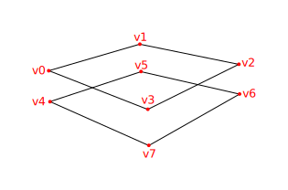

# 深度缓冲

> 原文链接：<https://kylemayes.github.io/vulkanalia/model/depth_buffering.html>
>
> Commit Hash: 72b9244ea1d53fa0cf40ce9dbf854c43286bf745

**本章代码:** [main.rs](https://github.com/chuigda/Vulkan-Tutorial-Rust-CN/tree/master/src/26_depth_buffering.rs) | [shader.vert](https://github.com/chuigda/Vulkan-Tutorial-Rust-CN/tree/master/shaders/26/shader.vert) | [shader.frag](https://github.com/chuigda/Vulkan-Tutorial-Rust-CN/tree/master/shaders/26/shader.frag)

The geometry we've worked with so far is projected into 3D, but it's still completely flat. In this chapter we're going to add a Z coordinate to the position to prepare for 3D meshes. We'll use this third coordinate to place a square over the current square to see a problem that arises when geometry is not sorted by depth.

我们的几何图形已经被投影到了三维空间中，但到目前为止它还是完全扁平的。在本章中我们会为位置添加一个 Z 坐标，以为 3D 网格做准备。我们将使用这第三个坐标来将一个正方形放在当前正方形上方，以观察当几何图形没有按深度排序时会出现的问题。

## 3D 几何图形

Change the `Vertex` struct to use a 3D vector for the position, and update the `format` in the corresponding `vk::VertexInputAttributeDescription` and update the offsets in the others:

修改 `Vertex` 结构体，为位置使用一个 3D 向量，然后更新相应的 `vk::VertexInputAttributeDescription` 中的 `format` 字段，并更新其他的偏移量：

```rust,noplaypen
#[repr(C)]
#[derive(Copy, Clone, Debug)]
struct Vertex {
    pos: Vec3,
    color: Vec3,
    tex_coord: Vec2,
}

impl Vertex {
    const fn new(pos: Vec3, color: Vec3, tex_coord: Vec2) -> Self {
        Self { pos, color, tex_coord }
    }

    fn binding_description() -> vk::VertexInputBindingDescription {
        vk::VertexInputBindingDescription::builder()
            .binding(0)
            .stride(size_of::<Vertex>() as u32)
            .input_rate(vk::VertexInputRate::VERTEX)
            .build()
    }

    fn attribute_descriptions() -> [vk::VertexInputAttributeDescription; 3] {
        let pos = vk::VertexInputAttributeDescription::builder()
            .binding(0)
            .location(0)
            .format(vk::Format::R32G32B32_SFLOAT)
            .offset(0)
            .build();
        let color = vk::VertexInputAttributeDescription::builder()
            .binding(0)
            .location(1)
            .format(vk::Format::R32G32B32_SFLOAT)
            .offset(size_of::<Vec3>() as u32)
            .build();
        let tex_coord = vk::VertexInputAttributeDescription::builder()
            .binding(0)
            .location(2)
            .format(vk::Format::R32G32_SFLOAT)
            .offset((size_of::<Vec3>() + size_of::<Vec3>()) as u32)
            .build();
        [pos, color, tex_coord]
    }
}
```

Next, update the vertex shader to accept and transform 3D coordinates as input. Don't forget to recompile it afterwards!

接着，更新顶点着色器来接受 3D 坐标作为输入。别忘了重新编译着色器！

```glsl
layout(location = 0) in vec3 inPosition;

// ...

void main() {
    gl_Position = ubo.proj * ubo.view * ubo.model * vec4(inPosition, 1.0);
    fragColor = inColor;
    fragTexCoord = inTexCoord;
}
```

Lastly, update the `vertices` container to include Z coordinates:

最后，更新 `VERTICES` 来包含 Z 坐标：

```rust,noplaypen
static VERTICES: [Vertex; 4] = [
    Vertex::new(vec3(-0.5, -0.5, 0.0), vec3(1.0, 0.0, 0.0), vec2(1.0, 0.0)),
    Vertex::new(vec3(0.5, -0.5, 0.0), vec3(0.0, 1.0, 0.0), vec2(0.0, 0.0)),
    Vertex::new(vec3(0.5, 0.5, 0.0), vec3(0.0, 0.0, 1.0), vec2(0.0, 1.0)),
    Vertex::new(vec3(-0.5, 0.5, 0.0), vec3(1.0, 1.0, 1.0), vec2(1.0, 1.0)),
];
```

If you run your application now, then you should see exactly the same result as before. It's time to add some extra geometry to make the scene more interesting, and to demonstrate the problem that we're going to tackle in this chapter. Duplicate the vertices to define positions for a square right under the current one like this:

如果你现在运行程序，你应该会看到和之前完全一样的结果。现在是时候添加一些额外的几何图形来让场景更有趣，并展示我们将在本章中解决的问题了。复制顶点来定义一个处在当前正方形下方的正方形的位置，像这样：



Use Z coordinates of `-0.5` and add the appropriate indices for the extra square:

将 Z 坐标设置为 `-0.5`，并为额外的正方形添加合适的索引：

```rust,noplaypen
static VERTICES: [Vertex; 8] = [
    Vertex::new(vec3(-0.5, -0.5, 0.0), vec3(1.0, 0.0, 0.0), vec2(1.0, 0.0)),
    Vertex::new(vec3(0.5, -0.5, 0.0), vec3(0.0, 1.0, 0.0), vec2(0.0, 0.0)),
    Vertex::new(vec3(0.5, 0.5, 0.0), vec3(0.0, 0.0, 1.0), vec2(0.0, 1.0)),
    Vertex::new(vec3(-0.5, 0.5, 0.0), vec3(1.0, 1.0, 1.0), vec2(1.0, 1.0)),
    Vertex::new(vec3(-0.5, -0.5, -0.5), vec3(1.0, 0.0, 0.0), vec2(1.0, 0.0)),
    Vertex::new(vec3(0.5, -0.5, -0.5), vec3(0.0, 1.0, 0.0), vec2(0.0, 0.0)),
    Vertex::new(vec3(0.5, 0.5, -0.5), vec3(0.0, 0.0, 1.0), vec2(0.0, 1.0)),
    Vertex::new(vec3(-0.5, 0.5, -0.5), vec3(1.0, 1.0, 1.0), vec2(1.0, 1.0)),
];

const INDICES: &[u16] = &[
    0, 1, 2, 2, 3, 0,
    4, 5, 6, 6, 7, 4,
];
```

Run your program now and you'll see something resembling an Escher illustration:

运行程序，你会看到类似于埃舍尔（Escher）艺术作品的图像：


> 译注：[莫里茨·科内利斯·埃舍尔](https://zh.wikipedia.org/zh-cn/%E8%8E%AB%E9%87%8C%E8%8C%A8%C2%B7%E7%A7%91%E5%86%85%E5%88%A9%E6%96%AF%C2%B7%E5%9F%83%E8%88%8D%E5%B0%94) 是荷兰著名版画艺术家，因其视错觉艺术作品而闻名。

The problem is that the fragments of the lower square are drawn over the fragments of the upper square, simply because it comes later in the index array. There are two ways to solve this:

问题在于下面的正方形的片元覆盖了上面的正方形的片元，而这仅仅是因为它在索引数组中出现的更晚。有两种方法可以解决这个问题：

* Sort all of the draw calls by depth from back to front
* Use depth testing with a depth buffer

* 将所有绘制调用按深度从后向前排序
* 使用深度缓冲进行深度测试

The first approach is commonly used for drawing transparent objects, because order-independent transparency is a difficult challenge to solve. However, the problem of ordering fragments by depth is much more commonly solved using a *depth buffer*. A depth buffer is an additional attachment that stores the depth for every position, just like the color attachment stores the color of every position. Every time the rasterizer produces a fragment, the depth test will check if the new fragment is closer than the previous one. If it isn't, then the new fragment is discarded. A fragment that passes the depth test writes its own depth to the depth buffer. It is possible to manipulate this value from the fragment shader, just like you can manipulate the color output.

第一种方法通常用于绘制透明物体，因为要实现与绘制顺序无关的透明是很困难的。然而，要根据深度对片元排序，更常见的做法是使用*深度缓冲（depth buffer）*。深度缓冲是一个额外的附件，它存储了每个位置的深度，就像颜色附件存储了每个位置的颜色一样。每当光栅化器产生一个片元时，深度测试会检查新片元是否比之前的更“近”。如果不是，则丢弃新片元。通过深度测试的片元会将自己的深度写入深度缓冲。深度值也可以从片元着色器中操作，就像操作颜色输出一样。

Before we continue, there is one issue we need to fix. The perspective projection matrix generated by `cgmath::perspective` in `App::update_uniform_buffer` uses the OpenGL depth range of `-1.0` to `1.0`. We want to use the Vulkan range of `0.0` to `1.0` instead so we'll pre-multiply the generated perspective matrix with a [correction matrix](https://matthewwellings.com/blog/the-new-vulkan-coordinate-system) that maps the OpenGL range to the Vulkan range:

在我们继续之前，有一个问题需要解决。`App::update_uniform_buffer` 中 `cgmath::perspective` 生成的透视投影矩阵使用了 OpenGL 的深度范围 `-1.0` 到 `1.0`。我们想要使用 Vulkan 的深度范围 `0.0` 到 `1.0`，所以我们将生成的透视矩阵与一个[校正矩阵](https://matthewwellings.com/blog/the-new-vulkan-coordinate-system)相乘，将 OpenGL 的范围映射到 Vulkan 的范围：

```rust,noplaypen
let correction = Mat4::new(
    1.0,  0.0,       0.0, 0.0,
    // 我们同时通过这行的 `-1.0` 翻转了 Y 轴。
    0.0, -1.0,       0.0, 0.0,
    0.0,  0.0, 1.0 / 2.0, 0.0,
    0.0,  0.0, 1.0 / 2.0, 1.0,
);

let proj = correction
    * cgmath::perspective(
        Deg(45.0),
        self.data.swapchain_extent.width as f32 / self.data.swapchain_extent.height as f32,
        0.1,
        10.0,
    );

// 下面这行已经不需要了，因为我们已经使用新的校正矩阵反转了 Y 轴。
// proj[1][1] *= -1.0;
```

Note that `cgmath::Matrix4::new` constructs a matrix in column-major order, so the parameters we passed to it seem to be transposed. So the actual matrix would look like this in row-major order:

注意 `cgmath::Matrix4::new` 以列主序构造矩阵，所以我们传递给它的参数看起来像是被转置过。实际构造出的矩阵在行主序下看起来像这样：

```text
1   0   0   0
0  -1   0   0
0   0   ½   ½
0   0   0   1
```

## 深度图像与视图

A depth attachment is based on an image, just like the color attachment. The difference is that the swapchain will not automatically create depth images for us. We only need a single depth image, because only one draw operation is running at once. The depth image will again require the trifecta of resources: image, memory and image view.

和颜色附件一样，深度附件也是基于图像的。区别在于交换链不会自动为我们创建深度图像。我们只需要一个深度图像，因为同时只有一个绘制操作在运行。深度图像同样需要三个资源：图像、内存和图像视图。

```rust,noplaypen
struct AppData {
    // ...
    depth_image: vk::Image,
    depth_image_memory: vk::DeviceMemory,
    depth_image_view: vk::ImageView,
}
```

Create a new function `create_depth_objects` to set up these resources:

创建一个新函数 `create_depth_objects` 来设置这些资源：

```rust,noplaypen
impl App {
    unsafe fn create(window: &Window) -> Result<Self> {
        // ...
        create_command_pool(&instance, &device, &mut data)?;
        create_depth_objects(&instance, &device, &mut data)?;
        // ...
    }
}

unsafe fn create_depth_objects(
    instance: &Instance,
    device: &Device,
    data: &mut AppData,
) -> Result<()> {
    Ok(())
}
```

Creating a depth image is fairly straightforward. It should have the same resolution as the color attachment, defined by the swapchain extent, an image usage appropriate for a depth attachment, optimal tiling and device local memory. The only question is: what is the right format for a depth image? The format must contain a depth component, indicated by `D??_` in the `vk::Format` variant.

创建深度图像非常直观。深度图像应该具有以下属性：由交换链范围定义的、与颜色附件相同的分辨率，适用于深度附件的图像用法，最佳平铺模式，并且存储在设备本地内存中。唯一的问题是：深度图像的正确格式是什么？格式必须包含一个深度分量，由 `vk::Format` 变体中的 `D??_` 表示。

Unlike the texture image, we don't necessarily need a specific format, because we won't be directly accessing the texels from the program. It just needs to have a reasonable accuracy, at least 24 bits is common in real-world applications. There are several formats that fit this requirement:

<!-- 这里不使用术语 texel，因为上下文里其实没提到 texture -->
不同于纹理图像的是，我们并不需要一个特定的像素格式，因为我们不会直接在程序中访问深度图像中的像素。深度图像中的像素只要有一个合理的精度就行。现实世界中的应用程序通常都使用至少 24 位的精度，有几种格式符合这个要求：

* `vk::Format::D32_SFLOAT` &ndash; 32-bit float for depth
* `vk::Format::D32_SFLOAT_S8_UINT` &ndash; 32-bit signed float for depth and 8 bit stencil component
* `vk::Format::D24_UNORM_S8_UINT` &ndash; 24-bit float for depth and 8 bit stencil component

* `vk::Format::D32_SFLOAT` &ndash; 为深度使用 32 位浮点数
* `vk::Format::D32_SFLOAT_S8_UINT` &ndash; 为深度使用 32 位有符号浮点数，同时为模板分量使用 8 个位
* `vk::Format::D24_UNORM_S8_UINT` &ndash; 为深度使用 24 位浮点数，同时为模板分量使用 8 个位

The stencil component is used for [stencil tests](https://en.wikipedia.org/wiki/Stencil_buffer), which is an additional test that can be combined with depth testing. We'll look at this in a future chapter.

模板分量可以被用于[模板测试](https://en.wikipedia.org/wiki/Stencil_buffer)，模板测试可以与深度测试结合使用。我们将在未来的章节中讨论这个。

We could simply go for the `vk::Format::D32_SFLOAT` format, because support for it is extremely common (see the hardware database), but it's nice to add some extra flexibility to our application where possible. We're going to write a `get_supported_format` function that takes a list of candidate formats in order from most desirable to least desirable and returns the first that satisfies our requirements:

我们可以直接选择 `vk::Format::D32_SFLOAT`，因为它的支持非常普遍（参见硬件数据库），但是在可能的情况下，为我们的应用程序增加一些额外的灵活性是很好的。我们将编写一个 `get_supported_format` 函数，它接受一个候选格式列表，将其中的格式按照最理想到最不理想的顺序排列，并返回第一个满足我们要求的格式：

```rust,noplaypen
unsafe fn get_supported_format(
    instance: &Instance,
    data: &AppData,
    candidates: &[vk::Format],
    tiling: vk::ImageTiling,
    features: vk::FormatFeatureFlags,
) -> Result<vk::Format> {
    candidates
        .iter()
        .cloned()
        .find(|f| {

        })
        .ok_or_else(|| anyhow!("Failed to find supported format!"))
}
```

The support of a format depends on the tiling mode and usage, so we must also include these as parameters. The support of a format can be queried using the `get_physical_device_format_properties` function:

受支持的格式与图像的平铺模式和用法有关，因此我们必须将它们作为参数传递。可以使用 `get_physical_device_format_properties` 函数查询支持的格式：

```rust,noplaypen
let properties = instance.get_physical_device_format_properties(
    data.physical_device,
    *f,
);
```

The `vk::FormatProperties` struct contains three fields:

`vk::FormatProperties` 结构体有以下字段：

* `linear_tiling_features` &ndash; Use cases that are supported with linear tiling
* `optimal_tiling_features` &ndash; Use cases that are supported with optimal tiling
* `buffer_features` &ndash; Use cases that are supported for buffers

* `linear_tiling_features` &ndash; 支持线性平铺模式的用例
* `optimal_tiling_features` &ndash; 支持最佳平铺模式的用例
* `buffer_features` &ndash; 支持缓冲的用例

Only the first two are relevant here, and the one we check depends on the value provided for the `tiling` parameter of the function:

只有前两个与本章相关，我们根据 `tiling` 参数的值来检查其中的一个：

```rust,noplaypen
match tiling {
    vk::ImageTiling::LINEAR => properties.linear_tiling_features.contains(features),
    vk::ImageTiling::OPTIMAL => properties.optimal_tiling_features.contains(features),
    _ => false,
}
```

We'll use this function now to create a `get_depth_format` helper function to select a format with a depth component that supports usage as depth attachment:

现在我们将使用这个函数来创建一个 `get_depth_format` 辅助函数，以选择一个支持用作深度附件的深度分量格式：

```rust,noplaypen
unsafe fn get_depth_format(instance: &Instance, data: &AppData) -> Result<vk::Format> {
    let candidates = &[
        vk::Format::D32_SFLOAT,
        vk::Format::D32_SFLOAT_S8_UINT,
        vk::Format::D24_UNORM_S8_UINT,
    ];

    get_supported_format(
        instance,
        data,
        candidates,
        vk::ImageTiling::OPTIMAL,
        vk::FormatFeatureFlags::DEPTH_STENCIL_ATTACHMENT,
    )
}
```

Call the function to find a depth format from `create_depth_objects`:

从 `create_depth_objects` 调用该函数来选择深度格式：

```rust,noplaypen
let format = get_depth_format(instance, data)?;
```

We now have all the required information to invoke our `^create_image` and `^create_image_view` helper functions:

现在我们已经有了调用 `create_image` 和 `create_image_view` 辅助函数所需的所有信息：

```rust,noplaypen
let (depth_image, depth_image_memory) = create_image(
    instance,
    device,
    data,
    data.swapchain_extent.width,
    data.swapchain_extent.height,
    format,
    vk::ImageTiling::OPTIMAL,
    vk::ImageUsageFlags::DEPTH_STENCIL_ATTACHMENT,
    vk::MemoryPropertyFlags::DEVICE_LOCAL,
)?;

data.depth_image = depth_image;
data.depth_image_memory = depth_image_memory;

// Image View

data.depth_image_view = create_image_view(device, data.depth_image, format)?;
```

However, the `^create_image_view` function currently assumes that the subresource always uses `vk::ImageAspectFlags::COLOR`, so we will need to turn that field into a parameter:

然而，`create_image_view` 函数目前假设子资源总是使用 `vk::ImageAspectFlags::COLOR`，因此我们需要将该字段变成一个参数：

```rust,noplaypen
unsafe fn create_image_view(
    device: &Device,
    image: vk::Image,
    format: vk::Format,
    aspects: vk::ImageAspectFlags,
) -> Result<vk::ImageView> {
    let subresource_range = vk::ImageSubresourceRange::builder()
        .aspect_mask(aspects)
        .base_mip_level(0)
        .level_count(1)
        .base_array_layer(0)
        .layer_count(1);

    // ...
}
```

Update all calls to this function to use the right aspect:

更新所有调用点，传递正确的 `aspects`：

```rust,noplaypen
create_image_view(device, *i, data.swapchain_format, vk::ImageAspectFlags::COLOR)

// ...

data.depth_image_view = create_image_view(
    device,
    data.depth_image,
    format,
    vk::ImageAspectFlags::DEPTH,
)?;

// ...

data.texture_image_view = create_image_view(
    device,
    data.texture_image,
    vk::Format::R8G8B8A8_SRGB,
    vk::ImageAspectFlags::COLOR,
)?;
```

That's it for creating the depth image. We don't need to map it or copy another image to it, because we're going to clear it at the start of the render pass like the color attachment.

创建深度图像就是这样。我们不需要映射它或将另一个图像复制到它，因为我们将在渲染通道的开始处清除它，就像颜色附件一样。

### 显式转换深度图像

We don't need to explicitly transition the layout of the image to a depth attachment because we'll take care of this in the render pass. However, for completeness I'll still describe the process in this section. You may skip it if you like.

我们不需要显式地将图像的布局转换为深度附件，因为我们将在渲染流程中处理这个问题。然而，为了完整起见，我仍然会在本节中描述这个过程。如果你愿意，你可以跳过它。

Make a call to `transition_image_layout` at the end of the `create_depth_objects` function like so:

在 `create_depth_objects` 函数的最后，像这样调用 `transition_image_layout`：

```rust,noplaypen
transition_image_layout(
    device,
    data,
    data.depth_image,
    format,
    vk::ImageLayout::UNDEFINED,
    vk::ImageLayout::DEPTH_STENCIL_ATTACHMENT_OPTIMAL,
)?;
```

The undefined layout can be used as initial layout, because there are no existing depth image contents that matter. We need to update some of the logic in `transition_image_layout` to use the right subresource aspect:

未定义布局可以被作为初始布局，因为深度图像中没有需要考虑的现有内容。我们需要更新 `transition_image_layout` 中的一些逻辑，以使用正确的子资源 aspect：

```rust,noplaypen
let aspect_mask = if new_layout == vk::ImageLayout::DEPTH_STENCIL_ATTACHMENT_OPTIMAL {
    match format {
        vk::Format::D32_SFLOAT_S8_UINT | vk::Format::D24_UNORM_S8_UINT =>
            vk::ImageAspectFlags::DEPTH | vk::ImageAspectFlags::STENCIL,
        _ => vk::ImageAspectFlags::DEPTH
    }
} else {
    vk::ImageAspectFlags::COLOR
};

let subresource = vk::ImageSubresourceRange::builder()
    .aspect_mask(aspect_mask)
    .base_mip_level(0)
    .level_count(1)
    .base_array_layer(0)
    .layer_count(1);
```

Although we're not using the stencil component, we do need to include it in the layout transitions of the depth image.

尽管我们没有用到模板分量，我们仍然需要在深度图像的布局转换中包含它。

Finally, add the correct access masks and pipeline stages:

最后，添加正确的访问掩码和管线阶段：

```rust,noplaypen
let (
    src_access_mask,
    dst_access_mask,
    src_stage_mask,
    dst_stage_mask,
) = match (old_layout, new_layout) {
    (vk::ImageLayout::UNDEFINED, vk::ImageLayout::DEPTH_STENCIL_ATTACHMENT_OPTIMAL) => (
        vk::AccessFlags::empty(),
        vk::AccessFlags::DEPTH_STENCIL_ATTACHMENT_READ | vk::AccessFlags::DEPTH_STENCIL_ATTACHMENT_WRITE,
        vk::PipelineStageFlags::TOP_OF_PIPE,
        vk::PipelineStageFlags::EARLY_FRAGMENT_TESTS,
    ),
    // ...
};
```

The depth buffer will be read from to perform depth tests to see if a fragment is visible, and will be written to when a new fragment is drawn. The reading happens in the `vk::PipelineStageFlags::EARLY_FRAGMENT_TESTS` stage and the writing in the `vk::PipelineStageFlags::LATE_FRAGMENT_TESTS`. You should pick the earliest pipeline stage that matches the specified operations, so that it is ready for usage as depth attachment when it needs to be.

深度缓冲会被读取并进行深度测试来判断片元是否可见，并且当绘制新片元时会被写入。读取发生在 `vk::PipelineStageFlags::EARLY_FRAGMENT_TESTS` 阶段，写入发生在 `vk::PipelineStageFlags::LATE_FRAGMENT_TESTS` 阶段。你应该选择最早的管线阶段来匹配指定的操作，这样就能确保深度图像在需要作为深度附件使用时已经就绪。

## 渲染流程

We're now going to modify `^create_render_pass` to include a depth attachment. First specify the `vk::AttachmentDescription`:

我们将修改 `create_render_pass` 函数来包含一个深度附件。首先指定 `vk::AttachmentDescription`：

```rust,noplaypen
let depth_stencil_attachment = vk::AttachmentDescription::builder()
    .format(get_depth_format(instance, data)?)
    .samples(vk::SampleCountFlags::_1)
    .load_op(vk::AttachmentLoadOp::CLEAR)
    .store_op(vk::AttachmentStoreOp::DONT_CARE)
    .stencil_load_op(vk::AttachmentLoadOp::DONT_CARE)
    .stencil_store_op(vk::AttachmentStoreOp::DONT_CARE)
    .initial_layout(vk::ImageLayout::UNDEFINED)
    .final_layout(vk::ImageLayout::DEPTH_STENCIL_ATTACHMENT_OPTIMAL);
```

The `format` should be the same as the depth image itself. This time we don't care about storing the depth data (`store_op`), because it will not be used after drawing has finished. This may allow the hardware to perform additional optimizations. Just like the color buffer, we don't care about the previous depth contents, so we can use `vk::ImageLayout::UNDEFINED` as `initial_layout`.

`format` 字段应该与深度图像的格式相同。这次我们不关心存储深度数据（`store_op`），因为在绘制完成后它将不会被使用。这可能允许硬件执行额外的优化。就像颜色缓冲一样，我们不关心之前的深度内容，所以我们可以使用 `vk::ImageLayout::UNDEFINED` 作为 `initial_layout`。

```rust,noplaypen
let depth_stencil_attachment_ref = vk::AttachmentReference::builder()
    .attachment(1)
    .layout(vk::ImageLayout::DEPTH_STENCIL_ATTACHMENT_OPTIMAL);
```

Add a reference to the attachment for the first (and only) subpass:

在第一个（也是唯一一个）子流程中添加对深度附件的引用：

```rust,noplaypen
let subpass = vk::SubpassDescription::builder()
    .pipeline_bind_point(vk::PipelineBindPoint::GRAPHICS)
    .color_attachments(color_attachments)
    .depth_stencil_attachment(&depth_stencil_attachment_ref);
```

Unlike color attachments, a subpass can only use a single depth (+stencil) attachment. It wouldn't really make any sense to do depth tests on multiple buffers.

不同于颜色附件的是，一个子流程只能使用一个深度（以及模板）附件。在多个缓冲上进行深度测试没有任何意义。

```rust,noplaypen
let attachments = &[color_attachment, depth_stencil_attachment];
let subpasses = &[subpass];
let dependencies = &[dependency];
let info = vk::RenderPassCreateInfo::builder()
    .attachments(attachments)
    .subpasses(subpasses)
    .dependencies(dependencies);
```

Next, update the `vk::RenderPassCreateInfo` struct to refer to both attachments.

接着，更新 `vk::RenderPassCreateInfo` 结构体，引用两个附件。

```rust,noplaypen
let dependency = vk::SubpassDependency::builder()
    .src_subpass(vk::SUBPASS_EXTERNAL)
    .dst_subpass(0)
    .src_stage_mask(vk::PipelineStageFlags::COLOR_ATTACHMENT_OUTPUT
        | vk::PipelineStageFlags::EARLY_FRAGMENT_TESTS)
    .src_access_mask(vk::AccessFlags::empty())
    .dst_stage_mask(vk::PipelineStageFlags::COLOR_ATTACHMENT_OUTPUT
        | vk::PipelineStageFlags::EARLY_FRAGMENT_TESTS)
    .dst_access_mask(vk::AccessFlags::COLOR_ATTACHMENT_WRITE
        | vk::AccessFlags::DEPTH_STENCIL_ATTACHMENT_WRITE);
```

Finally, we need to extend our subpass dependencies to make sure that there is no conflict between the transitioning of the depth image and it being cleared as part of its load operation. The depth image is first accessed in the early fragment test pipeline stage and because we have a load operation that *clears*, we should specify the access mask for writes.

<!-- TODO(chuigda): double check this -->
最后我们需要扩展我们的子流程依赖，以确保深度图像的转换和它作为加载操作的一部分被清除之间没有冲突。深度图像首先在早期片元测试管线阶段被访问，因为我们有一个*清除*的加载操作，所以我们应该为写入指定访问掩码。

## 帧缓冲

The next step is to modify the framebuffer creation to bind the depth image to the depth attachment. Go to `create_framebuffers` and specify the depth image view as second attachment:

下一步是修改帧缓冲的创建，将深度图像绑定到深度附件。转到 `create_framebuffers`，将深度图像视图指定为第二个附件：

```rust,noplaypen
let attachments = &[*i, data.depth_image_view];
let create_info = vk::FramebufferCreateInfo::builder()
    .render_pass(data.render_pass)
    .attachments(attachments)
    .width(data.swapchain_extent.width)
    .height(data.swapchain_extent.height)
    .layers(1);
```

The color attachment differs for every swapchain image, but the same depth image can be used by all of them because only a single subpass is running at the same time due to our semaphores.

每个交换链图像都有各自的颜色附件，但是由于我们的信号量，因为同一时间只有一个子流程在运行，因此所有交换链图像都可以使用同一个深度图像。

You'll also need to move the call to `create_framebuffers` to make sure that it is called after the depth image view has actually been created:

你还需要移动对 `create_framebuffers` 的调用，以确保它在深度图像视图实际创建后被调用：

```rust,noplaypen
unsafe fn create(window: &Window) -> Result<Self> {
    // ...
    create_depth_objects(&instance, &device, &mut data)?;
    create_framebuffers(&device, &mut data)?;
    // ...
}
```

## 清除值

Because we now have multiple attachments with `vk::AttachmentLoadOp::CLEAR`, we also need to specify multiple clear values. Go to `create_command_buffers` and add an instance of `vk::ClearValue` to the `clear_values` array:

因为现在我们有多个具有 `vk::AttachmentLoadOp::CLEAR` 的附件，所以我们也需要指定多个清除值。转到 `create_command_buffers`，并在 `clear_values` 数组中添加一个 `vk::ClearValue` 实例：

```rust,noplaypen
let color_clear_value = vk::ClearValue {
    color: vk::ClearColorValue {
        float32: [0.0, 0.0, 0.0, 1.0],
    },
};

let depth_clear_value = vk::ClearValue {
    depth_stencil: vk::ClearDepthStencilValue {
        depth: 1.0,
        stencil: 0,
    },
};

let clear_values = &[color_clear_value, depth_clear_value];
```

The range of depths in the depth buffer is `0.0` to `1.0` in Vulkan, where `1.0` lies at the far view plane and `0.0` at the near view plane. The initial value at each point in the depth buffer should be the furthest possible depth, which is `1.0`.

深度缓冲中的深度值范围是 `0.0` 到 `1.0`，其中 `1.0` 位于远平面，`0.0` 位于近平面。深度缓冲中每个点的初始值应该是最远的深度，即 `1.0`。

Note that the order of `clear_values` should be identical to the order of your attachments.

注意 `clear_values` 的顺序应该与你的附件的顺序相同。

## 深度与模板状态

The depth attachment is ready to be used now, but depth testing still needs to be enabled in the graphics pipeline. It is configured through the `vk::PipelineDepthStencilStateCreateInfo` struct:

深度附件现在已经可以使用了，但是深度测试仍然需要在图形管线中启用。它通过 `vk::PipelineDepthStencilStateCreateInfo` 结构体进行配置：

```rust,noplaypen
let depth_stencil_state = vk::PipelineDepthStencilStateCreateInfo::builder()
    .depth_test_enable(true)
    .depth_write_enable(true)
    // continued ...
```

The `depth_test_enable` field specifies if the depth of new fragments should be compared to the depth buffer to see if they should be discarded. The `depth_write_enable` field specifies if the new depth of fragments that pass the depth test should actually be written to the depth buffer.

`depth_test_enable` 字段指定新片元的深度是否应该与深度缓冲进行比较，以判断它们是否应该被丢弃。`depth_write_enable` 字段指定通过深度测试的片元的新深度是否应该被写入深度缓冲。

```rust,noplaypen
    .depth_compare_op(vk::CompareOp::LESS)
```

The `depth_compare_op` field specifies the comparison that is performed to keep or discard fragments. We're sticking to the convention of lower depth = closer, so the depth of new fragments should be *less*.

`depth_compare_op` 字段指定用于决定保留还是丢弃片元的比较方式。我们坚持使用较低的深度 = 更近的约定，因此新片元的深度应该是*较低的*。

```rust,noplaypen
    .depth_bounds_test_enable(false)
    .min_depth_bounds(0.0) // Optional.
    .max_depth_bounds(1.0) // Optional.
```

The `depth_bounds_test_enable`, `min_depth_bounds` and `max_depth_bounds` fields are used for the optional depth bound test. Basically, this allows you to only keep fragments that fall within the specified depth range. We won't be using this functionality.

`depth_bounds_test_enable`、`min_depth_bounds` 和 `max_depth_bounds` 字段用于可选的深度范围测试。简单来说，这允许你只保留落在指定深度范围内的片元。我们不会使用这个功能。

```rust,noplaypen
    .stencil_test_enable(false)
    .front(/* vk::StencilOpState */) // Optional.
    .back(/* vk::StencilOpState */); // Optional.
```

The last three fields configure stencil buffer operations, which we also won't be using in this tutorial. If you want to use these operations, then you will have to make sure that the format of the depth/stencil image contains a stencil component.

最后三个字段配置模板缓冲操作，我们在本教程中也不会使用。如果你想使用这些操作，那么你必须确保深度/模板图像的格式包含模板分量。

```rust,noplaypen
let info = vk::GraphicsPipelineCreateInfo::builder()
    .stages(stages)
    .vertex_input_state(&vertex_input_state)
    .input_assembly_state(&input_assembly_state)
    .viewport_state(&viewport_state)
    .rasterization_state(&rasterization_state)
    .multisample_state(&multisample_state)
    .depth_stencil_state(&depth_stencil_state)
    .color_blend_state(&color_blend_state)
    .layout(data.pipeline_layout)
    .render_pass(data.render_pass)
    .subpass(0);
```

Update the `vk::GraphicsPipelineCreateInfo` struct to reference the depth stencil state we just filled in. A depth stencil state must always be specified if the render pass contains a depth stencil attachment.

更新 `vk::GraphicsPipelineCreateInfo` 结构体，引用我们刚刚填充的深度模板状态。如果渲染通道包含深度模板附件，则总是需要指定深度模板状态。

If you run your program now, then you should see that the fragments of the geometry are now correctly ordered:

如果你现在运行程序，你应该会看到几何体的片元现在被正确排序了：


## 处理窗口大小变化

The resolution of the depth buffer should change when the window is resized to match the new color attachment resolution. Extend the `App::recreate_swapchain` method to recreate the depth resources in that case:

当窗口大小改变时，深度缓冲的分辨率应该改变，以匹配新的颜色附件分辨率。在这种情况下，扩展 `App::recreate_swapchain` 方法来重新创建深度资源：

```rust,noplaypen
unsafe fn recreate_swapchain(&mut self, window: &Window) -> Result<()> {
    self.device.device_wait_idle()?;
    self.destroy_swapchain();
    create_swapchain(window, &self.instance, &self.device, &mut self.data)?;
    create_swapchain_image_views(&self.device, &mut self.data)?;
    create_render_pass(&self.instance, &self.device, &mut self.data)?;
    create_pipeline(&self.device, &mut self.data)?;
    create_depth_objects(&self.instance, &self.device, &mut self.data)?;
    create_framebuffers(&self.device, &mut self.data)?;
    create_uniform_buffers(&self.instance, &self.device, &mut self.data)?;
    create_descriptor_pool(&self.device, &mut self.data)?;
    create_descriptor_sets(&self.device, &mut self.data)?;
    create_command_buffers(&self.device, &mut self.data)?;
    Ok(())
}
```

The cleanup operations should happen in the swapchain cleanup function:

清理操作应该在交换链清理函数中发生：

```rust,noplaypen
unsafe fn destroy_swapchain(&mut self) {
    self.device.destroy_image_view(self.data.depth_image_view, None);
    self.device.free_memory(self.data.depth_image_memory, None);
    self.device.destroy_image(self.data.depth_image, None);
    // ...
}
```

Congratulations, your application is now finally ready to render arbitrary 3D geometry and have it look right. We're going to try this out in the next chapter by drawing a textured model!

恭喜，你的应用程序现在终于可以正确地渲染任意的 3D 几何体了。我们将在下一章中通过绘制一个带纹理的模型尝试这项功能！
