# 介绍

> 原文链接：<https://kylemayes.github.io/vulkanalia/pipeline/introduction.html>
> 
> Commit Hash: f083d3b38f8be37555a1126cd90f6b73c8679d99

**本章代码：**[main.rs](https://github.com/KyleMayes/vulkanalia/tree/master/tutorial/src/08_graphics_pipeline.rs)

在接下来的几章中，我们会搭建图形管线。它会被用来画我们的第一个三角形。图形管线是一系列操作，将顶点与网格纹理转换为渲染目标中的像素点。下面是一个简化版的流程图：



*输入组装器（input assembler）*从指定缓冲中收集原始顶点数据，并且也可以使用顶点缓冲来重复使用某些元素，而不需要复制那些元素。

*顶点着色器（vertex shader）*在每个顶点执行，一般会将变换应用于顶点，将其顶点位置从模型空间转换至屏幕空间。它也会将每个顶点的数据传输至管线的下一步。

*密铺着色器（tessellation shader）*使你能够根据特定规则细分几何图形，以提升网格（mesh）的质量。这通常用于使砖墙和楼梯之类的表面从附近看上去更粗糙。

*几何着色器（geometry shader）*在每个图元（primitive，例如三角形、线、点）执行。它可以将图元舍弃或输出更多图元。这与密铺着色器类似，但更灵活。然而在如今的程序很少用几何着色器，因为在除了英特尔集显之外的大部分显卡上它的性能不是很好。

*光栅化（rasterization）*阶段将图元离散化（discretize）成为*片元（fragment）*。片元是填充帧缓冲的像素元素。任何在屏幕外的片元会被丢弃，顶点着色器输出的特征会在所有片元中被插值，如上图所示。通常在其它图元后的片元也会经过深度测试后被舍弃。

*片元着色器（fragment shader）*在每个存活的片元上执行。它会判断哪些片元会写入哪一个（或一些）帧缓冲中，并计算它们的颜色与深度值。它可以使用顶点着色器返回的插值后的数据，这些数据包括了纹理坐标以及光线的法向量等。

*混色（color blending）*阶段会把在帧缓冲中映射到同一个像素点的不同片元进行混合。片元可以简单地覆盖彼此，也可以叠加或根据透明度混合。

标为绿色的阶段被称为*固定功能（fixed-function）*阶段。这些阶段所执行的工作是预定义的，但你可以通过改变参数来改变它们所执行的操作。

标为橙色的阶段是*可编程的（programmable）*。你可以在这些阶段使将自己的代码上传至显卡，并使它执行预期中的操作。例如，你可以使用片元着色器来实现纹理、光照，甚至于光追。这些程序会在显卡的多个核心中同时执行来并行处理多个对象，例如顶点与片元。

如果你用过更早的 API，例如 OpenGL 和 Direct3D，那你应该熟悉用 `glBlendFunc` 或 `OMSetBlendState` 之类的函数修改管线设置。Vulkan 的图形管线几乎是完全不可变的，所以如果你想对渲染器进行修改，绑定其它帧缓冲，或是修改混合函数，那你必须重新创建整个管线。这么做的劣势在于你需要创建多个管线来满足你渲染所需的所有不同状态的组合。但是因为你在管线上所做的所有操作都已经事先可知，驱动就可以更好地优化你的管线。

一些可编程阶段根据需求不同是可选的。比如，如果你只是想画简单的几何图形，那么密铺和几何着色器阶段是可以被禁用的。如果你只关心深度值，那你可以禁用片元着色器阶段。这在[阴影贴图](https://en.wikipedia.org/wiki/Shadow_mapping)的生成上很有用。

在下一章中，我们会为了显示出一个三角形，先创建两个可编程阶段：顶点着色器与片元着色器。例如混合模式、视口、光栅化之类的固定功能的配置会在之后的一章中介绍。在 Vulkan 中配置渲染管线的最后一部分是指定输入与输出的帧缓冲。

我们先创建一个 `create_pipeline` 函数，并且在 `App::create` 中调用 `create_swapchain_image_views` 后立刻调用新创建的 `create_pipeline` 函数。我们会在之后几章中修改并实现这个函数。

```rust,noplaypen
impl App {
    unsafe fn create(window: &Window) -> Result<Self> {
        // ...
        create_swapchain_image_views(&device, &mut data)?;
        create_pipeline(&device, &mut data)?;
        // ...
    }
}

unsafe fn create_pipeline(device: &Device, data: &mut AppData) -> Result<()> {
    Ok(())
}
```
