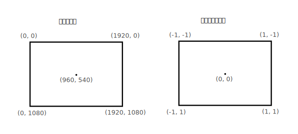

# 着色器模块

> 原文链接：<https://kylemayes.github.io/vulkanalia/pipeline/shader_modules.html>
>
> Commit Hash: 7becee96b0029bf721f833039c00ea2a417714dd

**本章代码：**[main.rs](https://github.com/chuigda/Vulkan-Tutorial-Rust-CN/tree/master/src/09_shader_modules.rs) | [shader.vert](https://github.com/chuigda/Vulkan-Tutorial-Rust-CN/tree/master/shaders/09/shader.vert) | [shader.frag](https://github.com/chuigda/Vulkan-Tutorial-Rust-CN/tree/master/shaders/09/shader.frag)

不同于以往的 API，Vulkan 中的着色器代码不是以 [GLSL](https://en.wikipedia.org/wiki/OpenGL_Shading_Language) 或者 [HLSL](https://en.wikipedia.org/wiki/High-Level_Shading_Language) 这种形式指定的，而是以一种被称为 [SPIR-V](https://www.khronos.org/spir) 的字节码格式指定的。Vulkan 和 OpenCL（都是 Knronos 的 API）都使用这种字节码格式。这种格式既可以用于图形着色器，也可以用于计算着色器，不过本书中我们会关注其中与图形管线有关的部分。

字节码格式的优势在于，GPU 厂商编写的将着色器代码转换为本地代码的编译器可以简单得多。过去的经验表明，如果使用 GLSL 这种人类可读的语法，一些 GPU 厂商对标准的解释是相当灵活的。如果你恰好使用了这些厂商的 GPU，编写了一些非平凡（non-trivial）的着色器，那么你的代码可能会因为语法错误而被其他厂商的驱动程序拒绝，或者可能更糟，由于编译器的 bug，你的着色器可能会以不同的方式运行。使用 SPIR-V 这种直接的字节码格式，这种情况有望得到避免。

不过，我们也不用手写字节码。Khronos 发行了他们的制造商无关的编译器，能够将 GLSL 编译为 SPIR-V 格式。该编译器能验证着色器代码符合标准，并生成 SPIR-V 二进制供你的程序使用。你也可以将这个编译期作为库引入你的程序，这样就能在运行时编译着色器代码了，不过在本教程中我们不这么做。

尽管我们可以直接通过 `glslangValidator.exe` 使用这个编译器，本教程中我们会使用由 Google 开发的 `glslc.exe`。`glslc` 的优势在于它与 GCC 和 Clang 这样的广为人知的编译器使用相同的命令行参数格式，并且支持一些额外的功能，例如 `#include`。这两个编译器都包含在 Vulkan SDK 中，所以你不需要额外下载任何东西。

GLSL 是一种使用类 C 语法的着色器语言。使用 GLSL 编写的程序包含了一个 main 函数，这一函数完成具体的运算操作。GLSL 使用全局变量进行输入输出，而不是使用参数和返回值。GLSL 语言本身包含了许多用于图形编程的特性，例如内建的向量和矩阵类型，用于叉乘和矩阵乘法的函数，以及用于计算反射向量的函数。

在 GLSL 中，向量类型使用 `vec` 加上一个表示向量元素的数字来命名。例如，一个三维空间中的位置可以用 `vec` 存储。可以通过 `.x` 这样的字段访问向量的单个分量，也可以通过一次性指定多个分量来创建一个新的向量。例如，表达式 `vec3(1.0, 2.0, 3.0).xy` 的结果是 `vec2`。向量的构造函数可以接受向量对象和标量值的组合。例如，可以使用 `vec3(vec2(1.0, 2.0), 3.0)` 来构造一个 `vec3`。

如我们在之前的章节中所提到的，要绘制一个三角形，我们需要编写一个顶点着色器和一个片元着色器。接下来的两节中我们会分别介绍这两个着色器的 GLSL 代码，之后我们会展示如何生成两个 SPIR-V 二进制文件，并将它们加载到程序中。

## 顶点着色器

顶点着色器处理每个传入的顶点。它以顶点的属性 —— 例如世界坐标、颜色、法线和纹理坐标 —— 作为输入，输出最终的裁剪坐标（clip coordinates）和需要传递给片元着色器的属性，例如颜色和纹理坐标。这些值将由光栅化器（rasterizer）在片元上进行插值，从而产生平滑的渐变。

*裁剪坐标*是一个顶点着色器输出的四维向量，它的四个分量会被除以第四个分量，从而产生一个*标准化设备坐标*（normalized device coordinate）。这些归一化设备坐标是 [齐次坐标](https://en.wikipedia.org/wiki/Homogeneous_coordinates)（homogeneous coordinates），它将帧缓冲映射到一个 `[-1, 1] × [-1, 1]` 的坐标系中，如下图所示：



如果你之前涉足过计算机图形学，你应该不会对这些东西感到陌生。而如果你曾使用过 OpenGL，那么你会注意到这里的 Y 轴和 OpenGL 是相反的，而 Z 轴则使用和 Direct3D 相同的范围，即从 `0` 到 `1`。

对于我们的第一个三角形，我们不会应用任何变换，而是直接指定三个顶点的标准化设备坐标，从而创建如下图所示的形状：


我们可以直接从顶点着色器输出标准化设备坐标 —— 只需要通过裁剪坐标将它们从顶点着色器输出，并将最后一个分量设置为 `1`，这样，将裁剪坐标转换为标准化设备坐标的除法就不会改变任何东西。

通常情况下，这些坐标应该存储在顶点缓冲（vertex buffer）中，但在 Vulkan 中创建并填充顶点缓冲并不是什么轻松的事。为了尽快让我们看到三角形，我们暂时将这些坐标直接包含在顶点着色器中。代码如下：

```glsl
#version 450

vec2 positions[3] = vec2[](
    vec2(0.0, -0.5),
    vec2(0.5, 0.5),
    vec2(-0.5, 0.5)
);

void main() {
    gl_Position = vec4(positions[gl_VertexIndex], 0.0, 1.0);
}
```

`main` 函数会对每个顶点执行一次。GLSL 内建的 `gl_VertexIndex` 中存储了当前顶点的索引，这一索引通常是用来引用顶点缓冲中顶点数据的，不过这里我们用它来索引一个硬编码的顶点数据数组。每个顶点的位置从着色器中的常量数组中获取，并与 `z` 和 `w` 分量组合，从而产生一个裁剪坐标。最后，我们将顶点的位置通过 `gl_Position` 内建变量输出。

## 片元着色器

由顶点着色器输出的顶点位置组成的三角形将会填充屏幕上一定范围内片元。片元着色器会对每个片元运行，输出帧缓冲上对应位置的颜色和深度。一个简单的将整个三角形填充为红色的片元着色器如下所示：

```glsl
#version 450

layout(location = 0) out vec4 outColor;

void main() {
    outColor = vec4(1.0, 0.0, 0.0, 1.0);
}
```

类似于顶点着色器的 `main` 函数，片元着色器的 `main` 函数会对每个片元执行一次。GLSL 中的颜色是一个四维向量，四个分量分别对应 R、G、B 和 alpha 四个通道，每个分量的取值范围都是 `[0, 1]`。不同于顶点着色器中的 `gl_Position`，片元着色器中没有用于输出颜色的内建变量。你必须为每个帧缓冲指定一个输出变量，并用`layout` 指定帧缓冲的索引。这里，我们将红色写入到 `outColor` 变量中，这一变量与索引为 `0` 的帧缓冲（也是唯一的帧缓冲）绑定。

## 逐顶点着色

整个三角形都是红色，一点都不好玩。你不觉得下面这样看起来更有趣吗？


我们修改一下两个着色器来实现这个效果。首先，我们为每个顶点指定各自的颜色。在顶点着色器中加入这样一个颜色数组：

```glsl
vec3 colors[3] = vec3[](
    vec3(1.0, 0.0, 0.0),
    vec3(0.0, 1.0, 0.0),
    vec3(0.0, 0.0, 1.0)
);
```

接着，我们将这些顶点的颜色传递给片元着色器，片元着色器就能将插值后的颜色输出到帧缓冲。在顶点着色器中添加一个颜色输出变量，并在 `main` 函数中写入它：

```glsl
layout(location = 0) out vec3 fragColor;

void main() {
    gl_Position = vec4(positions[gl_VertexIndex], 0.0, 1.0);
    fragColor = colors[gl_VertexIndex];
}
```

接着，我们在片元着色器中加入一个对应的输入变量：

```glsl
layout(location = 0) in vec3 fragColor;

void main() {
    outColor = vec4(fragColor, 1.0);
}
```

这个输入变量不一定要和顶点着色器中的输出变量使用相同的颜色，因为它们会根据 `location` 指令指定的索引被链接到一起。`main` 函数现在它会输出从 `fragColor` 读取的颜色和 alpha 值。如上图所示，`fragColor` 的值会自动在三个顶点之间进行插值，从而产生平滑的渐变。

## 编译着色器

在你工程的根目录里创建一个名为 `shader` 的文件夹（与 `src` 文件夹相邻），并将顶点着色器保存到 `shader.vert` 文件中，将片元着色器保存到 `shader.frag` 文件中。GLSL 着色器没有官方的文件扩展名，但是 `.vert` 和 `.frag` 这两个扩展名比较常用。

`shader.vert` 的内容如下：

```glsl
#version 450

layout(location = 0) out vec3 fragColor;

vec2 positions[3] = vec2[](
    vec2(0.0, -0.5),
    vec2(0.5, 0.5),
    vec2(-0.5, 0.5)
);

vec3 colors[3] = vec3[](
    vec3(1.0, 0.0, 0.0),
    vec3(0.0, 1.0, 0.0),
    vec3(0.0, 0.0, 1.0)
);

void main() {
    gl_Position = vec4(positions[gl_VertexIndex], 0.0, 1.0);
    fragColor = colors[gl_VertexIndex];
}
```

而 `shader.frag` 的内容如下：

```glsl
#version 450

layout(location = 0) in vec3 fragColor;

layout(location = 0) out vec4 outColor;

void main() {
    outColor = vec4(fragColor, 1.0);
}
```

接下来，我们使用 `glslc` 程序将这些着色器编译为 SPIR-V 字节码。

**Windows**

创建一个包含以下命令的 `compile.bat` 文件：

```bash
C:/VulkanSDK/x.x.x.x/Bin32/glslc.exe shader.vert -o vert.spv
C:/VulkanSDK/x.x.x.x/Bin32/glslc.exe shader.frag -o frag.spv
pause
```

把 `glslc.exe` 的路径替换为你安装 Vulkan SDK 的路径，双击这个文件来运行它。

**Linux**

创建一个包含以下命令的 `compile.sh` 文件：

```bash
/home/user/VulkanSDK/x.x.x.x/x86_64/bin/glslc shader.vert -o vert.spv
/home/user/VulkanSDK/x.x.x.x/x86_64/bin/glslc shader.frag -o frag.spv
```

将 `glslc` 的路径替换为你安装 Vulkan SDK 的路径。使用 `chmod +x compile.sh` 命令将这个脚本变得可执行，然后运行它。

**MacOS**

创建一个包含以下命令的 `compile.sh` 文件：

```bash
/User/user/VulkanSDK/x.x.x.x/macOS/bin/glslc shaders/shader.vert -o vert.spv
/User/user/VulkanSDK/x.x.x.x/macOS/bin/glslc shaders/shader.frag -o frag.spv
```

<div style="color: gray; user-select: none">
我是一条可爱的分割线，诶嘿诶嘿地爬 _(ÒωÓ๑ゝ∠)_
</div>

这两条命令告诉编译器从 GLSL 源文件中读取代码，并输出一个 SPIR-V 字节码文件。

如果你的着色器代码中有语法问题，编译器会告诉你问题所在。你可以试着故意遗漏一个逗号然后重新运行编译脚本。

你也可以在不带任何参数的情况下运行编译器，这样就能看到它支持的命令行参数。例如，它可以输出人类可读的字节码，这样你就能看到你的着色器在做什么，以及编译器对它做了哪些优化。

用命令行编译着色器是比较直观的方式，本教程中我们会一直沿用这种方式，不过你也可以在你的应用程序中直接编译着色器。Vulkan SDK 包含了 [libshaderc](https://github.com/google/shaderc)，它是一个库，你的程序可以用它在运行时直接将 GLSL 代码编译为 SPIR-V 字节码。

## 加载着色器

现在我们有了创建 SPIR-V 着色器的方式，是时候把它们引入我们的程序中，并插入渲染管线了。我们会使用 Rust 标准库中的 [`include_bytes!`](https://doc.rust-lang.org/stable/std/macro.include_bytes.html) 宏来将编译后的 SPIR-V 字节码包含进我们的程序中：

```rust,noplaypen
unsafe fn create_pipeline(device: &Device, data: &mut AppData) -> Result<()> {
    let vert = include_bytes!("../shaders/vert.spv");
    let frag = include_bytes!("../shaders/frag.spv");

    Ok(())
}
```

## 创建着色器模块

我们需要将着色器代码包装在一个 `vk::ShaderModule` 对象中才能将其传递给管线。让我们创建一个辅助函数 `create_shader_module` 来完成这一工作：

```rust,noplaypen
unsafe fn create_shader_module(
    device: &Device,
    bytecode: &[u8],
) -> Result<vk::ShaderModule> {
}
```

这个函数接受一个包含字节码的切片作为参数，并使用我们的逻辑设备，用字节码创建一个 `vk::ShaderModule` 对象。

创建着色器模块很简单，只要指定字节码切片的长度和字节码切片本身就行。这些信息被包含在 `vk::ShaderModuleCreateInfo` 结构体中。唯一的问题是，字节码的长度是以字节为单位指定的，但是这个结构体中的字节码切片是 `&[u32]` 而不是 `&[u8]`。因此，我们需要先将 `&[u8]` 转换为 `&[u32]`。

`vulkanalia` 提供了一个名为 `Bytecode` 的辅助结构体，我们将会用这个辅助结构体来将着色器代码复制到一个具有 `u32` 对齐的缓冲中。首先导入这个辅助结构体：

```rust,noplaypen
use vulkanalia::bytecode::Bytecode;
```

然后回到我们的 `create_shader_module` 函数，`Bytecode::new` 函数会在提供的字节切片长度不是 4 的整数倍，或者分配对齐的缓冲失败时返回错误。这里我们提供的字节码应该总是正确的，所以我们直接对结果调用 `unwrap`。

```rust,noplaypen
let bytecode = Bytecode::new(bytecode).unwrap();
```

接着我们创建 `vk::ShaderModuleCreateInfo` 并用它调用 `create_shader_module` 来创建着色器模块：

```rust,noplaypen
let info = vk::ShaderModuleCreateInfo::builder()
    .code_size(bytecode.code_size())
    .code(bytecode.code());

Ok(device.create_shader_module(&info, None)?)
```

这里的参数还是跟之前的对象创建函数一样：创建信息结构体和可选的自定义分配器。

着色器模块只是对我们从文件加载的着色器字节码的轻度封装。在图形管线创建的时候，这些 SPIR-V 字节码才会被编译链接为可以执行的机器码。也就是说，我们可以在渲染管线之后马上销毁着色器模块，这就使得我们可以把着色器模块写成 `create_pipeline` 函数中的局部变量，而不用放到 `AppData` 结构体中：

```rust,noplaypen
unsafe fn create_pipeline(device: &Device, data: &mut AppData) -> Result<()> {
    let vert = include_bytes!("../shaders/vert.spv");
    let frag = include_bytes!("../shaders/frag.spv");

    let vert_shader_module = create_shader_module(device, &vert[..])?;
    let frag_shader_module = create_shader_module(device, &frag[..])?;

    // ...
```

清理工作应该放在函数的最后，我们在这里添加两个对 `destroy_shader_module` 的调用。本章剩下的代码都会插入到这两行代码之前。

```rust,noplaypen
    // ...

    device.destroy_shader_module(vert_shader_module, None);
    device.destroy_shader_module(frag_shader_module, None);

    Ok(())
}
```

## 创建着色器阶段（shader stages）

要使用这些着色器，我们要在创建管线的时候通过 `vk::PipelineShaderStageCreationInfo` 将它们分配给特定的管线阶段。

我们从顶点着色器开始，在 `create_pipeline` 函数中添加以下代码：

```rust,noplaypen
let vert_stage = vk::PipelineShaderStageCreateInfo::builder()
    .stage(vk::ShaderStageFlags::VERTEX)
    .module(vert_shader_module)
    .name(b"main\0");
```

第一步告诉 Vulkan 着色器将会在哪个管线阶段使用。每个可编程阶段都有一个对应的枚举变体。<!-- 我们在上一章中已经介绍过了。—— 个屁 -->

接下来的两个字段指定了包含代码的着色器模块，以及要执行的函数，也就是*入口点*。这意味着你可以将多个片元着色器组合到一个着色器模块中，并使用不同的入口点来区分它们的行为。在这里我们仍然使用标准的 `main`。

还有一个可选的成员 `specialization_info`，这里我们不会用到它，但是值得讨论一下。它允许你为着色器常量指定值。你可以使用单个着色器模块，在管线创建的时候通过为其中的常量指定不同的值来配置它的行为。这比在渲染时使用变量来配置着色器更高效，因为编译器可以做一些优化，例如消除依赖于这些值的 `if` 语句。如果你没有这样的常量，那么你可以像我们这里一样跳过设置它。

仿照着再写一段用于片元着色器的代码就很简单了：

```rust,noplaypen
let frag_stage = vk::PipelineShaderStageCreateInfo::builder()
    .stage(vk::ShaderStageFlags::FRAGMENT)
    .module(frag_shader_module)
    .name(b"main\0");
```

这就是描述管线的可编程阶段的全部内容。在下一章中，我们会配置管线的固定功能阶段。
