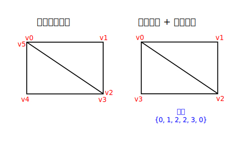

# 索引缓冲

> 原文链接：<https://kylemayes.github.io/vulkanalia/vertex/index_buffer.html>
>
> Commit Hash: 72b9244ea1d53fa0cf40ce9dbf854c43286bf745

**本章代码:** [main.rs](https://github.com/chuigda/Vulkan-Tutorial-Rust-CN/tree/master/src/20_index_buffer.rs)

在真正的应用程序中，你渲染的 3D 网格通常中的许多三角形之间都会共享顶点。即使是像绘制矩形这样简单的事情，也会遇到这种情况：



渲染一个矩形需要两个三角形，也就是说我们需要一个 6 个顶点的顶点缓冲。问题在于，有两个顶点的数据是重复的，这就导致了 50% 的冗余。对于更复杂的网格而言，平均每个顶点会被 3 个三角形使用，情况只会变得更糟。解决这个问题的方法就是使用*索引缓冲*。

一个索引缓冲实质上就是一个指向顶点缓冲的指针构成的数组。它允许你重排顶点数据，并为多个顶点复用现有数据。上面的插图展示了如果我们有一个包含每个独特顶点的顶点缓冲，那么矩形的索引缓冲会是什么样子。前三个索引定义了右上角的三角形，最后三个索引定义了左下角三角形的顶点。

## 创建索引缓冲

在本章中，我们将修改顶点数据，并添加索引数据来绘制一个像插图中那样的矩形。修改顶点数据以表示四个角：

```rust,noplaypen
static VERTICES: [Vertex; 4] = [
    Vertex::new(vec2(-0.5, -0.5), vec3(1.0, 0.0, 0.0)),
    Vertex::new(vec2(0.5, -0.5), vec3(0.0, 1.0, 0.0)),
    Vertex::new(vec2(0.5, 0.5), vec3(0.0, 0.0, 1.0)),
    Vertex::new(vec2(-0.5, 0.5), vec3(1.0, 1.0, 1.0)),
];
```

左上角是红色的，右上角是绿色的，右下角是蓝色的，而左下角是白色的。我们将添加一个新的数组 `INDICES` 来表示索引缓冲的内容。它应该与插图中的索引匹配，以绘制右上角的三角形和左下角的三角形。

```rust,noplaypen
const INDICES: &[u16] = &[0, 1, 2, 2, 3, 0];
```

取决于 `VERTICES` 中的条目数量，为索引缓冲使用 `u16` 和 `u32` 都是可以的。因为我们使用的顶点数量少于 65,536 个，所以我们可以使用 `u16`。

和顶点数据一样，索引也需要被上传到 `vk::Buffer` 中，GPU 才能访问它们。定义两个新的 `AppData` 字段来保存索引缓冲的资源：

```rust,noplaypen
struct AppData {
    // ...
    vertex_buffer: vk::Buffer,
    vertex_buffer_memory: vk::DeviceMemory,
    index_buffer: vk::Buffer,
    index_buffer_memory: vk::DeviceMemory,
}
```

接下来我们要添加的 `create_index_buffer` 函数和之前的 `create_vertex_buffer` 函数几乎一模一样：

```rust,noplaypen
impl App {
    unsafe fn create(window: &Window) -> Result<Self> {
        // ...
        create_vertex_buffer(&instance, &device, &mut data)?;
        create_index_buffer(&instance, &device, &mut data)?;
        // ...
    }
}

unsafe fn create_index_buffer(
    instance: &Instance,
    device: &Device,
    data: &mut AppData,
) -> Result<()> {
    let size = (size_of::<u16>() * INDICES.len()) as u64;

    let (staging_buffer, staging_buffer_memory) = create_buffer(
        instance,
        device,
        data,
        size,
        vk::BufferUsageFlags::TRANSFER_SRC,
        vk::MemoryPropertyFlags::HOST_COHERENT | vk::MemoryPropertyFlags::HOST_VISIBLE,
    )?;

    let memory = device.map_memory(
        staging_buffer_memory,
        0,
        size,
        vk::MemoryMapFlags::empty(),
    )?;

    memcpy(INDICES.as_ptr(), memory.cast(), INDICES.len());

    device.unmap_memory(staging_buffer_memory);

    let (index_buffer, index_buffer_memory) = create_buffer(
        instance,
        device,
        data,
        size,
        vk::BufferUsageFlags::TRANSFER_DST | vk::BufferUsageFlags::INDEX_BUFFER,
        vk::MemoryPropertyFlags::DEVICE_LOCAL,
    )?;

    data.index_buffer = index_buffer;
    data.index_buffer_memory = index_buffer_memory;

    copy_buffer(device, data, staging_buffer, index_buffer, size)?;

    device.destroy_buffer(staging_buffer, None);
    device.free_memory(staging_buffer_memory, None);

    Ok(())
}
```

不过还是有两个值得一提的区别，`size` 现在等于索引数量乘以索引类型 —— 即 `u16` 或 `u32` —— 的大小。`index_buffer` 的用途应该是 `vk::BufferUsageFlags::INDEX_BUFFER` 而不是 `vk::BufferUsageFlags::VERTEX_BUFFER`，这是有道理的。除此之外，整个过程完全一样。我们创建一个暂存缓冲来复制 `INDICES` 的内容，然后将其复制到最终的设备本地索引缓冲。

在程序结束时，和顶点缓冲一样，索引缓冲也应该被清理：

```rust,noplaypen
unsafe fn destroy(&mut self) {
    self.destroy_swapchain();
    self.device.destroy_buffer(self.data.index_buffer, None);
    self.device.free_memory(self.data.index_buffer_memory, None);
    self.device.destroy_buffer(self.data.vertex_buffer, None);
    self.device.free_memory(self.data.vertex_buffer_memory, None);
    // ...
}
```

## 使用索引缓冲

在绘制中使用索引缓冲需要修改 `create_command_buffer` 中的两个地方。首先我们需要绑定索引缓冲，就像绑定顶点缓冲时一样。区别在于索引缓冲只能由一个。不幸地是，我们无法为顶点的每个属性使用不同的索引，因此即使只有一个属性变化，我们仍然需要完全复制顶点数据。

```rust,noplaypen
device.cmd_bind_vertex_buffers(*command_buffer, 0, &[data.vertex_buffer], &[0]);
device.cmd_bind_index_buffer(*command_buffer, data.index_buffer, 0, vk::IndexType::UINT16);
```

一个索引缓冲通过 `cmd_bind_index_buffer` 来绑定，这个函数接受索引缓冲、字节偏移和索引数据类型作为参数。如前所述，可能的类型有 `vk::IndexType::UINT16` 和 `vk::IndexType::UINT32`。

只绑定索引缓冲还不够，我们要改变绘图命令，告诉 Vulkan 使用索引缓冲。删除 `cmd_draw` 那一行，并用 `cmd_draw_indexed` 替换：

```rust,noplaypen
device.cmd_draw_indexed(*command_buffer, INDICES.len() as u32, 1, 0, 0, 0);
```

<!-- TODO: chuigda: check twice, ask KyleMayes when necessary -->
`cmd_draw_indexed` 和 `cmd_draw` 的调用方式非常类似。命令缓冲后面的前两个参数指定了索引的数量和实例的数量。我们不使用实例化，所以只指定 `1` 个实例。索引的数量表示将传递给顶点缓冲的顶点数量。下一个参数指定了索引缓冲的偏移量，传递 `0` 会让显卡从第一个索引开始读取。倒数第二个参数指定了要添加到索引缓冲中的索引的偏移量。最后一个参数指定了实例化的偏移量，我们不使用实例化。

现在运行程序，然后你应该会看到如下画面：


现在你知道如何使用索引缓冲来重用顶点并节约内存了。这会在我们之后的章节中加载 3D 模型时变得尤为重要。

上一张已经提到过，你应该使用一次内存分配来分配多个资源，但事实上你应该更进一步。[驱动开发者建议](https://developer.nvidia.com/vulkan-memory-management)你将多个缓冲，例如顶点缓冲和索引缓冲，存储到一个 `vk::Buffer` 中，并在 `cmd_bind_vertex_buffers` 这样的命令中使用偏移量。这样做的好处是你的数据会对缓存更友好，因为它们彼此之间更近。如果你不在同一次渲染操作中使用它们，那么你甚至可以重用同一块内存 —— 当然前提是它们的数据被更新过。这被称为*别名*（aliasing），并且一些 Vulkan 函数有明确的标志来指定你想要这样做。
